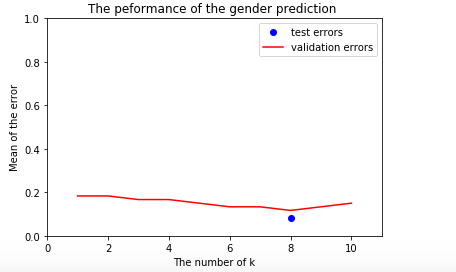

# Face Recognition and Gender Classification with K-Nearest Neighbours (KNN)

**Codes for this project are joint work with  [Beilei Tang](https://www.linkedin.com/in/beilei-tang-88828a146/) ** @beileitang1


## Introduction

We constructed facial recognition programs with KNN algorithm to classify the names and gendors of actors/actresses in a subset of the [FaceScrub](https://megaface.cs.washington.edu/) dataset. This project is done in Python on MacOS.

### K-nearest-neighbours explained

The k-nearest-neighbours (KNN) classification algoriths, is one of the simplest supervised Machine Learning algorithms. $K$ is interpreted as the number of nearest neighbors desired to examine.

Let's say we have a dataset consiting of data pairs. That is, our data is a collection of $(x_1, y1), (x_2, y_2), …, (x_N, y_N)$. We can collect all the datapoints and call them our feature  $Xtrain= [datapoint1, …, datapointN]$ and our target labels $Ytrain = [label1, …, labelN]$. Given an unseen datapoint $Xtest_i$, we are interested in knowing the label for this unseen point $Ytest_i$. If we have want to estimate the true label for a point $y_i$ with KNN, it calculates the Euclidean distances between that point and all the points in $Xtrain$ and returns the lables for $k$ points that are closest to $y_i$. The majority of the labels for closest points would be the estimated label for this new observation $y_i$.

Here in Figure 1 (please bear with my hand drawing (〃∀〃) ), we assume there are 2 kinds of lables, $\{ +,-\}  $. And the dots denote the datapoints. We set $K$, the number of nearest neighbours, to be 3. And we endup with 3 points being in blue circle to be taken into consideration. Since the majority, two, of them have the label $-$, the estimated label would be $-$ as well.

<p style="text-align: center;"> 
  <br><b>Figure 1</b>: KNN demo</p>


## Data 

### Dataset

In our study of name classification, we used a subset of 6 actors, including Angie Harmon, Peri Gilpin, Lorraine Bracco, Micheal Vartan, Daniel Radcliffe, and Gerad Butler. The first 3 actresses are female and the latter 3 are male. From the file paths of the cropped and uncropped images, we collected and saved information, such as actor name and gender, in a Python pandas dataframe.

For the gender classification, we trained KNN classifier on the above 6 actors/acctresses. And then we test the performance of this classifier on other 24 actors/acctresses (12 are male, 12 are female.)

###  Download

The full FaceScrub data set is 16.4 GB and contains uncropped, cropped images  and their bounding boxes sorted in folders of the names of actors/acctresses. 

First of all, we unzip each of the actor's folder containing the cropped images set on terminal 

```bash
$ tar -xvzf  test_cropped.zip  facescrub_aligned/Michael_Vartan/
```

And we unzip each of the actor's folder containing the uncropped images set on terminal 
```bash
$ tar -xvzf downloaded.tgz downloaded/Daniel\ Radcliffe/
```

### Matching 

Then,  we checked if each cropped image has their corresponding uncropped image.  We examine if output directories (one for the figures shown in this paper and another for the resized images) exist or not, then we load the file paths for each cropped and uncropped image in a pandas dataframe.

```python
    print('make resized dir if dir doesnt exist')
    download_data.mkdir_if_dne(constant.RESIZED_GRAY_IMG_DIR)
    download_data.mkdir_if_dne(constant.FIGURE_DIR)
    uncropped = []
    for actor in constant.ACTOR_LIST:
        files = download_data.get_actor_img(constant.UNCROPPED_IMG_DIR, actor)
        uncropped.extend(files)
    
    resized = glob.glob(constant.RESIZED_GRAY_IMG_DIR + "*")
    if not resized:  
        # trun cropped images into grayscale and resize
        print('%s is empty! start processing images' % constant.RESIZED_GRAY_IMG_DIR)
        for actor in constant.ACTOR_LIST:
            cropped_files = download_data.get_actor_img(constant.CROPPED_IMG_DIR, actor)
            resized_images = [download_data.process_cropped_image(file) for file in cropped_files]
            resized.extend(resized_images)
    else:
        print('loaded resized img paths')
    
    uncropped_df = pd.DataFrame({'uncropped_path':uncropped})
    uncropped_df['img_id'] = uncropped_df.uncropped_path.str.extract(r'(\d+)')
    uncropped_df['actor'] = uncropped_df['uncropped_path'].str.extract(r'uncropped_images/(.*)/')

```


In order to choose an optimzal number of nearest neighbor ($k_{best}$), images are divided into three sets: training, validation and testing set. The training set is used to calculate relevant distances; validation set is used to make sure we choose the $k$ with smallest mean $0-1$ error; testing set is used to examine the performance.

### Matching results and examples

We have most of the uncropped pictures aligned with their cropped correspondence. However, a few files seem to be broken. After matching up cropped and uncropped images, we end up with the number of images shown in **TABLE**. We then re-sized the coloured cropped images into $32\times 32-$pixel images and transformed them into black and white pictures.

<p style="text-align: center;"><br>
  <b>Figure 2</b>: Examples of cropped and uncropped images. <br>left: uncropped. middle: cropped. right: re-sized</p>

## 

### `Sampling

For each actor, $120$ images are randomly chosen with the Pandas data frame sample function. The first $100$ entries in the $120$ samples form the training set; $101-111$ entries are taken as validation set; The last $111-120$ images are used as the testing set. 

### Image processing

We loaded  and resized the matched images again with OpenCV-Python. The loaded images are converted into grayscale and r esized  to size of $32\times32\times3$(representing BGR form images) Python NumPy matrices. These images can further be flattened into $1-$dimensional array with the numpy.flatten() method. 

## KNN from Scratch

### 1. Euclidean distance

$$
\begin{align}
d(X,Y) &= \sqrt{(x_1-y_1)^2 +(x_2-y_2)^2 +(x_3-y_3)^2 +…+(x_n-y_n)^2}\\
&= \sqrt{\sum_{i=1}^{n} (x_i-y_i)^2}\\
\end{align}
$$

```python
def calculate_eculidean_dis(X_train, X_test):
    dist = np.sum(np.square(X_train - X_test))
    return dist
```

### 2. cal_neighbours

We sorted the distances between X_train and the given testing image, X_test, and return the locations where the closest neighbors are.

```python
def cal_neighbours(X_train, Y_train, X_test, k, neighbor_loc=False):
    distances =[]
    for i in range(len(X_train)-1):
        img_dist = calculate_eculidean_dis(X_test,X_train[i])
        distances.append((X_train[i],img_dist,Y_train[i]))
    index=np.asarray(distances)
    neighbour_location = np.argsort(index[:,1])[:5]
    
    distances_sort= sorted(distances, key=lambda j: j[1])[:k]
    neighbors = distances_sort
    
    if neighbor_loc:
        return neighbors, neighbour_location
    else:
        return neighbors
```


### 3. majority vote

```python
# majority vote to classifier the new example
def winner_vote(labels, display=True):
    from collections import Counter 
    list(labels)
    voted_label = labels
    temp = set(voted_label)
    result={}
    for i in temp:
        result[i]=voted_label.count(i) 
    winner = [(k, result[k]) for k in sorted(result, key=result.get, reverse=True)]
    k = Counter(labels)
    high = k.most_common(1)
    if display:
        for k, v in winner:
            print(k, v)
        print("---------------------------- ")
        print("---------------------------- ")
        print("the picture is :")
        print(high)
        print("---------------------------- ")
        print("---------------------------- ")
    return high
```


## Results

### Face recognition

We used $10$ different values for $k$ from $1$ to $10$ on validation data set, and the best performance is the value of $k$ equals to $4$. Then, by using the KNN algorithm with the best value of $k$ ($k=4$) on test set , we get the mean of error which is $0.267$

<p style="text-align: center;"><br>
  <b>Figure 3</b>: Performance for face recognition</p>

### Gender recognition

We tested different values for $k$ from $1$ to $10$ on validation set to get the best value of k. And we found the best performing value for $k$ is $8$ on the validation set with mean of testing error to be $0.083$

<p style="text-align: center;"><br>
  <b>Figure 3</b>: Performance for gender prediction</p>

